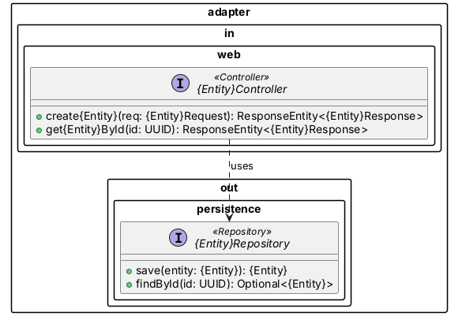

# Skill: PlantUML Interface Contract Generator

## ℹ️ Objective
Receives the same structured metadata snapshot produced by the `diagram-parser` skill and emits one `*_contract.puml` file per `<<Entity>>` resource. Each file formally declares the mandatory **Controller** and **Repository** interfaces for that resource, including all operation signatures, following the Onion Architecture and CQRS patterns.

## 🏗️ Architecture Constraints

### Layer Mapping (Onion)
| Stereotype | PlantUML Layer Tag | Package |
|---|---|---|
| `<<Controller>>` | `<<interface>>` | `adapter.in.web` |
| `<<Repository>>` | `<<interface>>` | `adapter.out.persistence` |
| `<<UseCase>>` (Command) | `<<interface>>` | `application.port.in` |
| `<<UseCase>>` (Query) | `<<interface>>` | `application.port.in` |

> Only **Controller** and **Repository** are mandatory outputs. `UseCase` ports are generated only when the metadata includes custom actions.

### CQRS Separation Rule
- **Command operations** (`Create`, `Update`, `Delete`, custom actions) → belong to a `*CommandUseCase` interface.
- **Query operations** (`GetById`, collection reads) → belong to a `*QueryUseCase` interface.
- Controllers depend on **both** use-case interfaces via constructor injection (shown as `..>` dependency arrows).

---

## 🛠️ Generation Rules

### 1. File Naming
- One file per `<<Entity>>`: `{entity_name_snake_case}_contract.puml`
- Example: `StudentGrade` → `student_grade_contract.puml`

### 2. Mandatory Interface: `<<Controller>>`
Generate an interface in the `adapter.in.web` package with the following operation mapping:

| Metadata verb / action | Controller method signature |
|---|---|
| `POST` (Create) | `+ create{Entity}(@RequestBody {Entity}Request req): ResponseEntity<{Entity}Response>` |
| `GET` (Element) | `+ get{Entity}ById(@PathVariable UUID id): ResponseEntity<{Entity}Response>` |
| `PUT` (Update) | `+ update{Entity}(@PathVariable UUID id, @RequestBody {Entity}Request req): ResponseEntity<{Entity}Response>` |
| `DELETE` | `+ delete{Entity}(@PathVariable UUID id): ResponseEntity<Void>` |
| `Custom Action` | `+ {action}({Entity}ActionRequest req): ResponseEntity<OperationStatus>` |

- Class name: `{Entity}Controller`
- Annotate with `<<Controller>>`

### 3. Mandatory Interface: `<<Repository>>`
Generate an interface in the `adapter.out.persistence` package derived directly from the `<<Repository>>` operations in the metadata:

| Repository method in UML | Interface method signature |
|---|---|
| `Create()` | `+ save(entity: {Entity}): {Entity}` |
| `GetById()` | `+ findById(id: UUID): Optional<{Entity}>` |
| `Update()` | `+ save(entity: {Entity}): {Entity}` *(same as Create — unified `save`)* |
| `Delete()` | `+ deleteById(id: UUID): void` |

- Class name: `{Entity}Repository`
- Annotate with `<<Repository>>`
- Extend `JpaRepository<{Entity}, UUID>` when the metadata `hardening_flags.put_sync` is true (signals Spring Data backing).

### 4. Optional Interfaces: `<<UseCase>>` Ports (CQRS)
Generate only when **custom actions** exist in metadata:

- `{Entity}CommandUseCase` — one method per Create/Update/Delete/Custom Action verb.
- `{Entity}QueryUseCase` — one method per Get/Query verb.

### 5. Dependency Arrows
Draw the following `..>` (usage/dependency) arrows to express wiring:

```
{Entity}Controller ..> {Entity}CommandUseCase : uses
{Entity}Controller ..> {Entity}QueryUseCase   : uses
{Entity}CommandUseCase ..> {Entity}Repository  : uses
{Entity}QueryUseCase   ..> {Entity}Repository  : uses
```

If no UseCase interfaces are generated, draw Controller → Repository directly.

### 6. Version / Concurrency Annotation
If `hardening_flags.409_required` is `true`, add the note:
```
note right of {Entity}Repository
  Optimistic Locking enforced.
  Repository MUST check version field before save.
end note
```

---

## ⚙️ Output Format

Each generated file MUST follow this skeleton exactly:



---

## ⚠️ Hard Constraints
- **Scope**: Generate one contract file **per `<<Entity>>`** only. Ignore non-entity classes.
- **Mandatory Operations**: Never omit an operation that has a corresponding verb in the metadata `allowed_verbs` list.
- **No Hallucination**: Do not invent operations not present in the metadata. Use `FIXME_OPERATION` for unresolvable verb mappings.
- **Naming Convention**: Interface names MUST be PascalCase. Method parameters MUST be camelCase.
- **Stateless Execution**: Do not assume any surrounding file context beyond the metadata snapshot provided.
***
