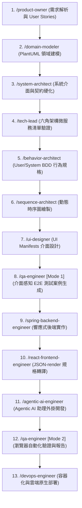

# Score Assistant

## 📁 SDD 核心設計目錄結構 (docs/)

### 01-requirements/ (源頭：模糊意圖)
**職責**：存放原始、非結構化的需求。這裡是所有開發動作的起點。
- **PRD/**：存放 Word、PDF 或原始 Markdown 格式的需求說明書。
- **user-stories/**：存放細分的 User Stories 或訪談紀錄。
- **external-specs/**：原始第三方/廠商規格 (如 Modbus, API)。
- **glossary.md**：領域專家詞彙表（確保 AI 在接下來的階段不會產生術語幻覺）。

### 02-design-specs/ (契約：技術硬化)
**職責**：將 01 的意圖轉化為「可驗證」的規格。這是 Agent 的主戰場。

1. **behavior-specs/ (行為契約)**
   - **內容**：BDD 格式的 `.feature` 檔案。
   - **意義**：定義系統的動態邏輯（Given/When/Then），作為測試階段的基準。

2. **uml/ (結構契約)**
   - **內容**：PlantUML (`.puml`) 檔案。
   - **意義**：定義系統骨架，包含類別圖 (Class) 與時序圖 (Sequence)。嚴格遵守 SOLID 原則。

3. **api-contracts/ (外交契約)**
   - **內容**：`openapi.yaml` (Swagger)。
   - **意義**：定義對外窗口。所有 Endpoint、Payload 欄位均鎖死，禁止 AI 自行通靈。

4. **db-schemas/ (持久化契約)**
   - **內容**：`schema.dbml` 或 SQL DDL 腳本。
   - **意義**：定義資料庫表結構、索引與外鍵關係。

5. **ui-schemas/ (介面契約)**
   - **內容**：SDUI 的 JSON Schema 與 Layout 定義。
   - **意義**：定義前端組件的規格，確保 UI 表現的一致性與可預測性。

6. **external-integrations/ (外部系統整合)**
   - **內容**：外部系統的映射與 Mock 規格。
   - **意義**：作為**防腐層 (Anticorruption Layer)**，將廠商雜亂的暫存器 (如 Modbus `0x4001`) 轉換為系統內部的清潔模型 (如 `Grid_Voltage`)。
   - **`{service_name}-service-manifest.yaml`**：由 Tech Lead 根據設計規格生成的六角架構微服務清單，定義系統中所有的 Ports 與 Adapters。

## 📁 工程實作與驗證目錄結構 (engineers/)

### 03-implementations/ (產出：具體實作)
**職責**：將 02 的設計契約嚴格轉化為可執行的系統程式碼。
- **backend/**：Spring Boot 響應式後端微服務實作（嚴守六角架構）。
- **devops/**：容器化與部署設定（包含 Dockerfile，負責將前端與後端打包為安全、極小化的運行映像檔）。
- **frontend/**：React 前端實作（負責處理 UI Manifest 與 JSON-render 轉譯）。

### 04-tests/ (驗證：自動化稽核)
**職責**：依據行為契約與 API 契約，對系統進行端到端 (E2E) 的自動化測試。
- **cases/**：由 QA Agent 自規格自動生成的確定性 E2E 測試案例。
- **reports/**：透過自動化測試執行所產出的標準化測試稽核報告。

## 🤖 Agent Workflows (.agents/workflows/)

Workflows 是 Agent 的操作指引，負責編排與轉換不同階段的設計規格。從最初的需求解析到最終的端到端驗證，十二項核心工作流程在開發管線中展開為 13 個依序執行的生命週期節點：

以下為各 Agent Workflow 的詳細職責說明：

- **/agentic-ai-engineer**：Agentic AI 開發工程師，專精於 CopilotKit V2、Spring AI 2.0.0+ 與 AGUI 協定，依照使用者需求與現有系統行為，開發能像外掛一般協助處理資料的 Agentic AI。
- **/behavior-architect**：資深 SDD 架構師，專精於事件驅動架構 (EDA) 與六角架構 (Hexagonal Architecture) 的 BDD 生成。
- **/devops-engineer**：資深 DevOps 工程師，專精於容器化、CI/CD 管道以及雲端原生部署。
- **/domain-modeler**：資深領域建模師，專精於領域驅動設計 (DDD) 與平台無關建模 (PIM)，將原始需求轉換為結構化、型別安全的 PlantUML 類別圖。
- **/product-owner**：專業產品負責人，專精於將功能需求解構為結構化的 User Stories，並彙整統一的領域術語表 (Domain Glossary) 作為唯一真相來源 (Source of Truth)。
- **/qa-engineer**：資深 QA 工程師，專精於自動化端到端 (E2E) 測試，具備兩種操作模式：自規格生成確定性的 E2E 測試案例，以及透過瀏覽器子代理 (browser subagents) 執行自動化測試並產出稽核報告。
- **/react-frontend-engineer**：資深前端工程師，專精於 React、JSON-render 與 `@json-render/shadcn`，原生利用預置的 shadcn/ui 組件將 UI Manifest 檔案轉換為執行期的 JSON-render 規格。
- **/sequence-architect**：動態流程架構師，使用嚴格定義的介面契約將 BDD 場景轉化為時序圖 (Sequence Diagrams)。
- **/spring-backend-engineer**：Spring 認證專業工程師，專精於使用 Spring Boot、WebFlux、Spring Data 與 GraphQL 進行響應式後端開發。
- **/system-architect**：高階編排器，能同時將 UML 模型轉換為 OpenAPI 契約、DBML 資料庫 Schema，以及 PlantUML 介面契約 (`*_contract.puml`)。
- **/tech-lead**：技術總監 (Tech Lead)，負責綜合 OpenAPI 契約、UML 圖表、PlantUML 介面契約與 DBML Schemas，生成並驗證標準化的六角架構微服務清單 (Hexagonal Service Manifest YAML)。
- **/ui-designer**：專業 Web UX/UI 設計師，將需求與行為規格轉換為符合 `ui-manifest-schema.json` 驗證標準的 UI Manifests。

## 🛠️ Agent Skills (.agents/skills/)

Skills 是提供給 Agent 的特定專項能力模組：

- **api-hook-generator**：自 UI Manifests 中作為 `data_ref` 參照的 OpenAPI `operationId` 項目，生成帶有型別的 TanStack Query (React Query) Hook 存根 (Stubs)。
- **bdd-generator**：將需求轉換為 Gherkin 特性文件 (Features) 的邏輯引擎，並具備 EDA 架構感知能力。
- **cloud-run-deployer**：將本地建置的 Docker 映像檔推送至 Google Artifact Registry，並對目標 Google Cloud Run 服務觸發無中斷滾動式重新部署。從作用中的 gcloud CLI 上下文讀取 GCP 設定，無需硬編碼憑證。
- **contract-generator**：將 Entity/Repository 詮釋資料轉換為 PlantUML 介面契約 (`*_contract.puml`) 的確定性生成器。強制執行 Onion Architecture 層邊界、CQRS 命令/查詢分離，並強制生成 `RestController`（REST 異動）、`GraphQLResolver`（集合查詢）與 `Repository` 介面定義。選用的 `Service` 介面遵循相同層級契約。
- **dbml-generator**：將 API/Entity 詮釋資料轉換為 DBML 的確定性生成器。強制執行 UUID 主鍵、關聯表級聯刪除 (Cascade Deletes)，以及基礎設施欄位的自動注入。
- **diagram-parser**：針對 PlantUML 內容的高精度轉譯器。透過識別 `<<Entity>>` 資源提取 API 詮釋資料，鎖定 `<<Repository>>` 介面動詞，並將關聯映射到 URI 層級結構。
- **docker-image-builder**：自動編譯 React 前端、打包 Spring Boot 後端，並建置安全且極小化體積的 Java 25 Docker 映像檔。
- **frontend-coding-policy**：強制執行的前端開發規範，涵蓋必填欄位紅星註記、送出前驗證、詳細 Toast 錯誤訊息、ISO 8601 日期格式以及檔案上傳範本。
- **json-render-transpiler**：確定性轉譯器，將 `ui-manifest.json` 組件樹轉換為輕量級執行期 JSON-render 規格，原生優先使用 `@json-render/shadcn` 的 36 個預置組件。
- **manifest-validator**：嚴格驗證六角架構微服務清單 (Hexagonal Service Manifest) 是否符合架構拓樸與 Schema 規範的驗證工具。
- **oas-generator**：將 API 詮釋資料轉換為 OpenAPI 3.2 YAML 的確定性生成器。強制執行回傳碼、Payload 範例、PATCH/PUT 並發控制與 GraphQL 重定向的嚴格標準。
- **robot-log-analyzer**：自動解析 Robot Framework 的 `output.xml` 測試結果，提取失敗步驟與錯誤訊息，並結合需求與 BDD 規格自動生成標準化的 E2E 測試稽核報告。
- **vitest-msw-tester**：針對 `@json-render/react` 頁面組件生成確定性的 Vitest + MSW 單元測試。強制使用 userEvent 代替 fireEvent、進行 Store 狀態斷言、驗證 executeBehavior 模擬呼叫以及 MSW 攔截檢查。
***
